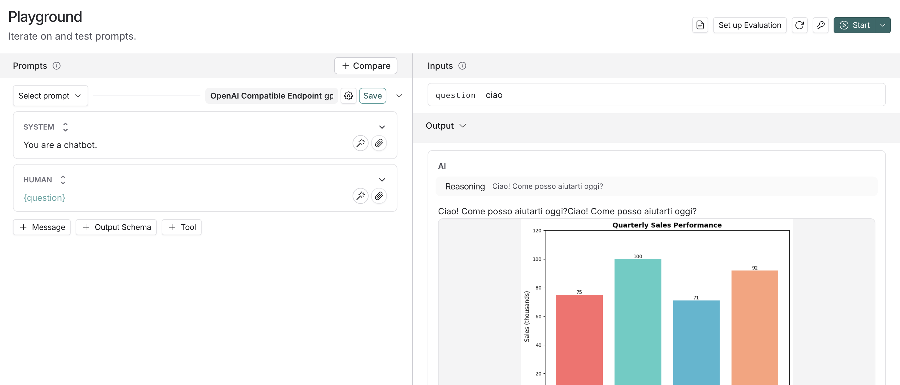

# OpenAI-Compatible Server

A modular Python server that provides an OpenAI-compatible chat completion API. You can add hooks that modify the LLM response, such as the chart matplotlib hook that automatically adds generated charts to responses.



## Project Structure

```
openai-compatible-endpoint/
├── main.py              # Entry point for running the server
├── server.py            # FastAPI application and endpoints
├── config.py            # Configuration and settings management
├── models.py            # Pydantic models for API requests
├── utils.py             # Utility functions for working with responses
├── pyproject.toml       # Project configuration and dependencies
├── Dockerfile           # Docker configuration
├── .dockerignore        # Files to exclude from Docker build
├── hooks/
│   ├── __init__.py      # Hook system (register_post_hook, apply_post_hooks)
│   └── chart.py         # Chart generation hook
├── images/
│   └── chart-hook.png   # Example screenshot of chart hook in action
└── README.md
```

## Quick Start

### Prerequisites

1. **Install uv (if not already installed):**
   ```bash
   # macOS/Linux
   curl -LsSf https://astral.sh/uv/install.sh | sh
   
   # Or via pip
   pip install uv
   ```

2. **Install dependencies:**
   ```bash
   uv sync
   ```
   
   This will create a virtual environment and install all dependencies from `pyproject.toml`.

3. **Set your OpenAI API key:**
   ```bash
   export OPENAI_API_KEY=your-api-key-here
   ```
   
   Or create a `.env` file:
   ```
   OPENAI_API_KEY=your-api-key-here
   ```

### Running the Server

Run the main script using `uv`:

```bash
uv run python main.py
```

Or activate the virtual environment first:
```bash
source .venv/bin/activate  # On macOS/Linux
# or
.venv\Scripts\activate     # On Windows
python main.py
```

The server will start on `http://localhost:8000`

### Running with Docker

1. **Build the Docker image:**
   ```bash
   docker build -t openai-compatible-endpoint .
   ```

2. **Run the container:**
   ```bash
   docker run -p 8000:8000 \
     -e OPENAI_API_KEY=your-api-key-here \
     openai-compatible-endpoint
   ```

   Or use a `.env` file:
   ```bash
   docker run -p 8000:8000 \
     --env-file .env \
     openai-compatible-endpoint
   ```

3. **The server will be available at:** `http://localhost:8000`

### Testing the Server

**Health check:**
```bash
curl http://localhost:8000/health
```

**Chat completion (with chart):**
```bash
curl -X POST http://localhost:8000/v1/chat/completions \
  -H "Content-Type: application/json" \
  -d '{
    "model": "gpt-3.5-turbo",
    "messages": [{"role": "user", "content": "Show me quarterly sales data"}],
    "stream": false
  }'
```

The response will include:
- Text content from the LLM
- A base64-encoded PNG chart image

## Architecture

### Core Components

- **`main.py`**: Entry point that starts the server
- **`server.py`**: FastAPI application with OpenAI-compatible endpoints
- **`config.py`**: Settings management using Pydantic Settings
- **`models.py`**: Pydantic models for request validation

### Hook System

The server uses a flexible hook system for modifying responses:

- **`hooks/__init__.py`**: Core hook registration and application logic
- **`hooks/chart.py`**: Example hook that adds matplotlib charts to responses

To add your own hook, create a new file in the `hooks/` directory:

```python
# hooks/my_hook.py
from typing import Dict, Any

def my_hook(response: Dict[str, Any]) -> Dict[str, Any]:
    # Modify response here
    return response
```

Then register it in `server.py`:

```python
from hooks.my_hook import my_hook
register_post_hook(my_hook)
```

### Utilities

- **`utils.py`**: Helper functions for extracting charts and text from responses, making requests, etc.

## Exposing with Ngrok

To expose the server publicly (e.g., for use with LangSmith or external clients):

### 1. Install Ngrok

Download from [ngrok.com](https://ngrok.com/) or install via package manager:
```bash
# macOS
brew install ngrok

# Or download from https://ngrok.com/download
```

### 2. Start the Server

```bash
uv run python main.py
```

### 3. Expose with Ngrok

In a separate terminal:

```bash
ngrok http 8000
```

Ngrok will provide a public URL like:
```
https://abc123.ngrok-free.app
```

### 4. Use the Public URL

**For LangSmith or other clients:**
- Base URL: `https://abc123.ngrok-free.app/v1/`
- Endpoint: `https://abc123.ngrok-free.app/v1/chat/completions`

### Example with Ngrok URL

```bash
curl -X POST https://abc123.ngrok-free.app/v1/chat/completions \
  -H "Content-Type: application/json" \
  -d '{
    "model": "gpt-3.5-turbo",
    "messages": [{"role": "user", "content": "hello"}],
    "stream": false
  }'
```

## Response Format

The server returns responses in OpenAI-compatible format with multimodal content:

```json
{
  "choices": [{
    "message": {
      "role": "assistant",
      "content": [
        {
          "type": "text",
          "text": "Hello! Here's the quarterly sales data..."
        },
        {
          "type": "image_url",
          "image_url": {
            "url": "data:image/png;base64,iVBORw0KGgo..."
          }
        }
      ]
    }
  }]
}
```

## Using the Utilities

The `utils.py` module provides helper functions for working with responses:

```python
from utils import (
    extract_chart_from_response,
    extract_text_from_response,
    make_chat_request
)

# Make a request
response = make_chat_request(
    "http://localhost:8000",
    [{"role": "user", "content": "hello"}]
)

# Extract components
chart = extract_chart_from_response(response)
text = extract_text_from_response(response)

# Chart URL can be used directly in HTML:
# 
```

## Features

- ✅ OpenAI API compatible endpoint (`/v1/chat/completions`)
- ✅ Modular architecture with separated concerns
- ✅ Flexible hook system for customizing responses
- ✅ Automatic chart generation with every response (via hook)
- ✅ Streaming support (set `"stream": true`)
- ✅ CORS enabled for cross-origin requests
- ✅ Production-ready error handling
- ✅ LangSmith compatible

## Troubleshooting

**"No module named 'fastapi'"**
- Install dependencies using `uv`: `uv sync`
- Or install manually: `uv pip install -e .`

**"OPENAI_API_KEY not set"**
- Export the environment variable: `export OPENAI_API_KEY=your-key`
- Or create a `.env` file with `OPENAI_API_KEY=your-key`

**Ngrok connection refused**
- Make sure the server is running on port 8000
- Check that ngrok is forwarding to `localhost:8000`

**Chart not appearing in response**
- Check that the response contains a `content` array with both text and image_url items
- Verify the chart hook is registered in `server.py`

**Import errors**
- Make sure you're running from the project root directory
- Check that all files are in the correct locations

## License

This script is provided as-is for demonstration purposes.
